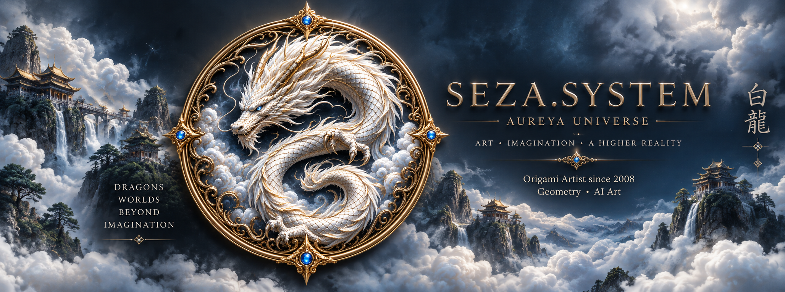
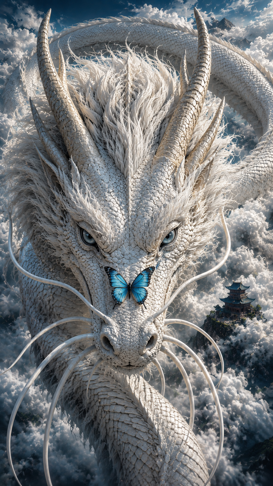
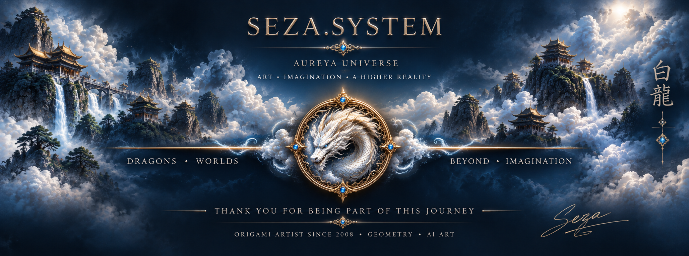

<p align="center">
  
</p>

<h1 align="center">SEZA.SYSTEM</h1>

### DRAGONS • WORLDS • BEYOND IMAGINATION

```

**SEZA.SYSTEM** is an original visual art project centered on the dragon.

This repository is the evolving visual gallery of the project — 
a collection of original digital artworks, dragon imagery, worlds, 
scenes, and visual creations developed by **Északi Gábor (seza)**.

The project combines imagination, geometry, digital creation, 
and AI-assisted creative work to build a recognizable visual world around the dragon.

```

## ARTWORK


<div align="center">


</div>

## DRAGON GALLERY

```

The dragon is the central visual presence of SEZA.SYSTEM.

Each artwork explores the dragon in a different environment,
atmosphere, composition, or visual story while 
maintaining the recognizable identity of the project.

```
<div align="center">




</div>

<div align="center">


</div>


## WORLDS

```

Mountains, temples, clouds, forests, oceans, deserts, 
celestial landscapes and other environments become part of the dragon's world.

The setting may change.

The dragon remains the constant.

```

## ABOUT
```

SEZA.SYSTEM is created by Északi Gábor, a Hungarian origami artist and designer active since 2008.

The project represents a separate digital creative field developed alongside his long-term work in origami.

AI collaborators are part of the creative process. The artistic direction, concepts, 
visual development, selection, and overall creative system are developed by the creator.

```


## FOLLOW THE PROJECT

Official TikTok:

**[@seza.system](https://www.tiktok.com/@seza.system)**

New visual works and ongoing creations are published as the project evolves.

---

<div align="center">



</div>
